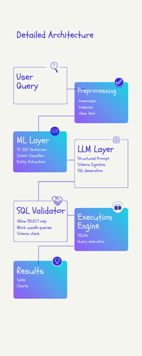
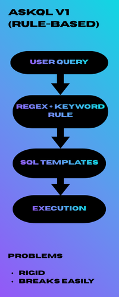
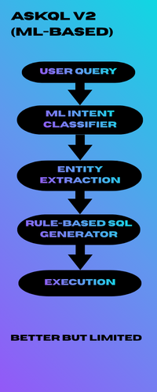
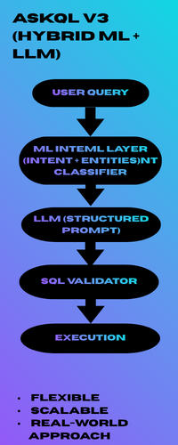

# 🚀 AskQL 3.0 : Natural Language to SQL using ML + LLM (Hybrid System)


AskQL 3.0 is a full-stack application that converts natural language queries into SQL using a **hybrid approach combining Machine Learning and Large Language Models (LLMs)**.

This project demonstrates how modern NL → SQL systems are built in production — not by relying solely on LLMs, but by **augmenting them with structured ML pipelines and validation layers**.

---

## 🧠 Key Idea

LLMs are powerful, but unreliable when used alone.

AskQL 3.0 solves this by combining:

- **ML Layer** → Understands intent and extracts entities  
- **LLM Layer** → Generates SQL intelligently  
- **Validation Layer** → Ensures safety and correctness  

---
## 🌍 Real-World Relevance

Hybrid NL → SQL systems like AskQL 3.0 reflect how modern data platforms are built:

- Combine structured pipelines with LLMs
- Use validation layers to prevent unsafe execution
- Rely on prompt engineering + schema grounding

Similar approaches are used in:
- BI tools (natural language dashboards)
- Data copilots
- Enterprise analytics platforms

---


## 🏗️ Architecture
<p align="center">
  
</p>

<p align="center">
  
  
  
</p>


---

## ✨ Features

- 💬 Natural language → SQL conversion  
- 🧠 ML-based intent classification (TF-IDF + Logistic Regression)  
- 🔍 Hybrid entity extraction (regex + keyword mapping)  
- 🤖 LLM-based SQL generation (structured prompts)  
- 🛡️ SQL validation (prevents unsafe queries)  
- 🔁 Error correction loop for failed queries  
- ⚡ FastAPI backend + React frontend  
- 🌍 Deployment-ready architecture  

---

## 🏗️ Tech Stack

### Backend
- FastAPI  
- SQLite  
- scikit-learn  
- pandas  

### NLP / ML
- TF-IDF Vectorization  
- Logistic Regression  
- Regex-based entity extraction  

### LLM Integration
- Prompt engineering (structured templates)  
- Compatible with OpenAI / local LLMs (via wrapper)  

### Frontend
- React (Vite)  
- Chat-style UI  

---

## 📁 Project Structure

```

askql-v3/
│
├── backend/
│   ├── app/
│   │   ├── main.py
│   │   ├── db.py
│   │   │
│   │   ├── ml/
│   │   │   ├── train.py
│   │   │   ├── preprocess.py
│   │   │   ├── entity_extractor.py
│   │   │   ├── intent_model.pkl
│   │   │   └── vectorizer.pkl
│   │   │
│   │   ├── llm/
│   │   │   └── sql_generator.py
│   │   │
│   │   ├── sql/
│   │   │   └── validator.py
│   │
│   ├── requirements.txt
│
├── frontend/
│   ├── src/
│   │   └── App.jsx
│   ├── package.json
│
└── README.md

````

---

## 🚀 Getting Started

### 1️⃣ Clone the Repository

```bash
git clone https://github.com/your-username/askql-v3.git
cd askql-v3
````

---

### 2️⃣ Setup Backend

```bash
cd backend
pip install -r requirements.txt
```

---

### 3️⃣ Train ML Model

```bash
cd app/ml
python train.py
```

This generates:

* `intent_model.pkl`
* `vectorizer.pkl`

---

### 4️⃣ Run Backend

```bash
cd ../../
uvicorn app.main:app --reload
```

👉 API Docs: [http://127.0.0.1:8000/docs](http://127.0.0.1:8000/docs)

---

### 5️⃣ Setup Frontend

```bash
cd frontend
npm install
npm run dev
```

👉 App: [http://localhost:5173](http://localhost:5173)

---

## 💬 Example Queries

```
total sales by country
top 3 customers by total sales
orders between 100 and 500
customers who have no orders
```

---

## 🔄 Evolution of AskQL

| Version  | Approach        | Key Limitation                      |
| -------- | --------------- | ----------------------------------- |
| AskQL v1 | Rule-Based      | Rigid, breaks with phrasing         |
| AskQL v2 | ML-Based        | Limited on complex queries          |
| AskQL v3 | ML + LLM Hybrid | Requires validation + prompt tuning |

---

## ⚠️ Limitations

* LLM may hallucinate incorrect columns if not constrained
* Requires well-designed prompts for high accuracy
* Performance depends on ML training data quality
* Complex nested queries may still need refinement

---

## 🔮 Future Improvements

* Add evaluation metrics (accuracy, precision)
* Schema-aware dynamic query generation
* Better entity extraction using advanced NER
* Support for multiple databases (PostgreSQL, MySQL)
* Fine-tuned LLM or RAG-based approach

---

## 🎯 Key Learnings

* Rule-based systems are deterministic but brittle
* ML improves flexibility but requires data
* LLMs enable complexity but need constraints
* Hybrid systems are the most practical approach

---

## 🤝 Contributing

Contributions are welcome! Feel free to open issues or submit pull requests.

---

## 📬 Contact

If you found this interesting or want to collaborate, feel free to connect!

---

⭐ If you like this project, consider giving it a star!

```

